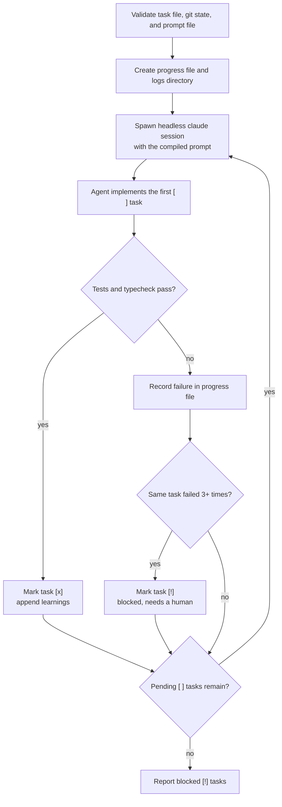

# Ralph

Ralph is a bash loop that runs Claude Code autonomously against a markdown task file. Each iteration spawns a headless `claude` session that implements exactly one task, verifies it with the project's test and typecheck commands, and updates the task file. Activity streams live to the terminal where Ralph runs, and every iteration is logged to disk.

Task files (`*.TASK.md`) are produced by the **planning-stories** skill, which breaks a user story into small, independently verifiable tasks in the exact format Ralph expects.

## How it works

One iteration of the loop:

1. Ralph builds the agent prompt from `RALPH-PROMPT.md`, injecting the task file path, progress file path, and iteration number.
2. The agent picks the first pending `[ ]` task, reads the progress file for learnings from earlier iterations, and implements that one task only.
3. The agent finds the project's test and typecheck commands in `AGENTS.md` or `package.json` (and records them in `AGENTS.md` if missing) and runs both.
4. If verification passes, the task is marked `[x]` and learnings are appended to the progress file. If it fails, the task stays `[ ]` and the failure is recorded so the next iteration can try differently.
5. A task that keeps failing is retried at most 3 times with the same approach; after that the agent must either change approach or mark it `[!]` (blocked).
6. The loop ends when the agent reports the `<promise>COMPLETE</promise>` sentinel, no `[ ]` tasks remain, or a safety limit trips (see exit conditions below).



### Task states

| Marker | State | Meaning |
|--------|-------|---------|
| `[ ]` | pending | not started |
| `[x]` | complete | implemented and verified (tests and typecheck pass) |
| `[!]` | blocked | needs human attention; Ralph prints these when it exits |

## Requirements

- `claude` CLI installed and logged in. It must be a real executable on `PATH`; shell aliases are invisible to scripts (wrap the alias in an executable script, or point `CLAUDE_BIN` at the binary).
- `jq`
- `git`
- bash. On macOS, `realpath` ships with macOS 13 (Ventura) and newer; on older versions run `brew install coreutils`.

## Installation (global, macOS/Linux)

From this folder:

```bash
mkdir -p ~/.local/bin
cp ralph.sh ~/.local/bin/ralph
chmod +x ~/.local/bin/ralph
cp RALPH-PROMPT.md ~/.local/bin/RALPH-PROMPT.md
```

Make sure `~/.local/bin` is on your `PATH`. Add this to `~/.bashrc` or `~/.zshrc` if it is not already there:

```bash
export PATH="$HOME/.local/bin:$PATH"
```

Verify by running `ralph` with no arguments; it should print usage. For a system-wide install, use `/usr/local/bin` instead of `~/.local/bin`.

The prompt template is resolved in this order:

1. `$RALPH_PROMPT_FILE` if set
2. `./RALPH-PROMPT.md` in the directory you run Ralph from (project-specific customization)
3. `RALPH-PROMPT.md` installed next to the script (the global default installed above)

## Usage

```bash
ralph <task-file.TASK.md> [max-iterations] [sleep-seconds]
```

Example:

```bash
cd ~/code/my-project
ralph stories/checkout-flow.TASK.md 50 3
```

Run Ralph from the root of the project the agent should work in. It asks before running outside a git repository or on the `main`/`master` branch. The task file can live anywhere; Ralph creates its artifacts next to it:

| File | Purpose |
|------|---------|
| `<name>.progress.txt` | running log: what each iteration did, files changed, learnings |
| `<name>.logs/iteration-N.jsonl` | raw stream-json event log for iteration N, including turns, cost, and duration |

### Workflow with the planning-stories skill

1. In a Claude Code session with the planning-stories skill available, ask it to break your story into tasks and produce a `.TASK.md` file for ralph.
2. Run `ralph path/to/story.TASK.md` from the project root.
3. When Ralph finishes, review the diff and commit. The agent itself never commits or touches git history.

## Configuration

Positional arguments:

| Argument | Default | Meaning |
|----------|---------|---------|
| task file | required | path to a file ending in `.TASK.md` |
| max-iterations | 100 | hard cap on loop iterations |
| sleep-seconds | 2 | pause between iterations |

Environment overrides:

| Variable | Default | Meaning |
|----------|---------|---------|
| `RALPH_MAX_TURNS` | 50 | max agent turns per iteration |
| `RALPH_STALL_LIMIT` | 5 | abort after this many consecutive iterations with no progress |
| `CLAUDE_BIN` | `claude` | claude executable to invoke |
| `RALPH_PROMPT_FILE` | lookup order | explicit path to the prompt template |

## Terminal output

While running you see:

- colored headers for the run and each iteration
- the agent's assistant text streamed live
- dim one-line previews of every tool call (tool name plus target file, command, or pattern)
- a summary line after each iteration with turn count, cost, and wall time

On exit, Ralph prints any `[!]` blocked tasks that need your attention.

## Exit conditions

| Condition | Exit code |
|-----------|-----------|
| all tasks complete (agent sentinel or no `[ ]` tasks left) | 0 |
| interrupted with Ctrl-C | 130 |
| stalled: no progress for `RALPH_STALL_LIMIT` consecutive iterations | 1 |
| `claude` failed 3 iterations in a row | 1 |
| reached max iterations with tasks still pending | 1 |

## Safety

- The agent runs with `--dangerously-skip-permissions`: it can execute any command in the project without asking. Run it on a feature branch and review the full diff before committing.
- Each iteration is capped by `RALPH_MAX_TURNS`, and the loop itself is capped by max iterations, the stall detector, and the consecutive-failure abort.
- Each iteration is a full Claude session; watch the per-iteration cost lines to track spend.

## Customizing the agent prompt

Edit `RALPH-PROMPT.md` (a project-local copy in the working directory, or the global one installed next to the script). Placeholders substituted on every iteration:

| Placeholder | Replaced with |
|-------------|---------------|
| `{{TASK_FILE}}` | absolute path to the task file |
| `{{PROGRESS_FILE}}` | absolute path to the progress file |
| `{{ITERATION}}` | current iteration number |
