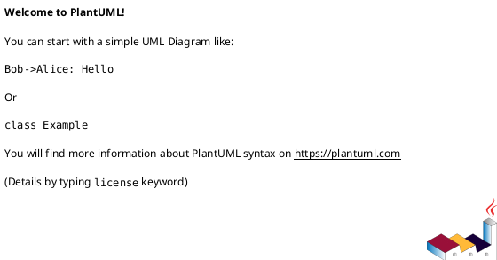
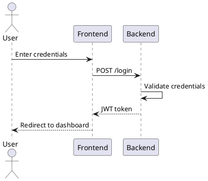
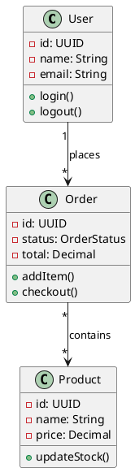
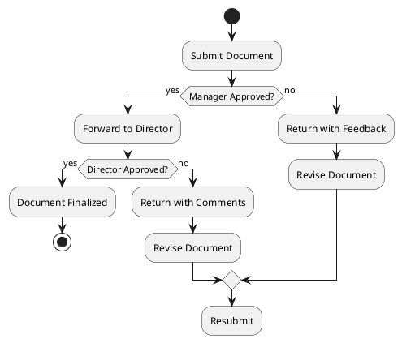
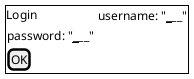

# PlantUML Diagramming Expert

## Purpose

Expert in the **PlantUML** diagramming language for creating UML and non-UML diagrams. Translates textual descriptions into visual representations using PlantUML syntax. Understands structure, syntax, styling, and best practices for creating various types of diagrams.

## When to Use

Auto-invoke when users mention:

- **PlantUML** - "plantuml", "plantuml diagram", "plantuml code"
- **UML diagrams** - "uml diagram", "use case diagram", "sequence diagram", "class diagram"
- **Flowcharts** - "flowchart", "flow chart", "activity diagram", "workflow diagram"
- **State/Process** - "state diagram", "state machine", "process flow", "component diagram"
- **Visual from text** - "create diagram from text", "visualize this", "draw a diagram", "make a uml"
- **Wireframes** - "wireframe", "ui mockup", "screen mockup"

## Process

### 1. Analyze the Request

Determine the best diagram type based on user intent:

| User asks about                            | Use this diagram  |
| ------------------------------------------ | ----------------- |
| Time flow, API calls, chronological events | Sequence Diagram  |
| Data structure, inheritance, relationships | Class Diagram     |
| Business steps, workflow, decisions        | Activity Diagram  |
| System functionality, user interactions    | Use Case Diagram  |
| Object lifecycle, states, transitions      | State Diagram     |
| System components, dependencies            | Component Diagram |
| Instances, snapshots                       | Object Diagram    |
| Simple process, non-UML flow               | Flowchart         |

### 2. Gather Context

Use tools to collect information:

- Read existing documentation or requirements
- Search for related diagrams in the codebase
- Find data structures or API definitions if needed

### 3. Generate PlantUML Code

Always follow these core directives:

1. **Encapsulation:** Wrap PlantUML code in `@startuml` and `@enduml` tags
2. **Syntax Validity:** Ensure correct bracket closing, arrow types, and end keywords (`end`, `endif`, `endwhile`)
3. **Readability:** Use aliases (`alias X as Name`) for long class or participant names
4. **Layout:** Use directional hints (`left to right direction`, `top to bottom direction`) if default causes clutter

### 4. Provide Output

**MANDATORY: Code Block Format for PlantUML**

ALL PlantUML code MUST be wrapped in markdown code blocks using `puml` as the language identifier:



**Required Format Rules:**

1. **ALWAYS** start code blocks with ` ```puml ` (NOT just ` ``` ` without a language identifier)
2. **NEVER** use bare ` ``` ` for PlantUML code - always specify `puml`
3. **NEVER** output raw `@startuml`/`@enduml` without code block wrapping
4. Include a brief explanation of the diagram structure
5. Suggest rendering options (PlantUML server, VS Code extension, etc.)

## Diagram Types Reference

| Diagram               | Purpose                                                                        | Reference                                    |
| --------------------- | ------------------------------------------------------------------------------ | -------------------------------------------- |
| **Use Case Diagram**  | System functionality and actors, interactions between users and features       | [use-case-diagram.md](use-case-diagram.md)   |
| **Sequence Diagram**  | Interactions between objects over time, message flow in chronological order    | [sequence-diagram.md](sequence-diagram.md)   |
| **Class Diagram**     | Static structure of a system, classes, interfaces, and relationships           | [class-diagram.md](class-diagram.md)         |
| **Activity Diagram**  | Workflows or business processes, flow of control through actions and decisions | [activity-diagram.md](activity-diagram.md)   |
| **Component Diagram** | Organization and dependencies among components, interfaces, and nodes          | [component-diagram.md](component-diagram.md) |
| **State Diagram**     | Lifecycle of an object, states and transitions triggered by events             | [state-diagram.md](state-diagram.md)         |
| **Object Diagram**    | Instances of classes and their relationships at a specific point in time       | [object-diagram.md](object-diagram.md)       |
| **Flowchart**         | Simple process flows, non-UML alternative to activity diagrams                 | [flowchart.md](flowchart.md)                 |

## Choosing Between Diagram Types

When a request could fit multiple diagram types, use this decision guide:

| Scenario | Prefer | Why |
|----------|--------|-----|
| API calls, message flow | **Sequence** | Shows message order and participants clearly |
| Business process with decisions | **Activity** | Better for branching logic and workflows |
| Object changes states over time | **State** | Focus on lifecycle and transitions |
| Static data structure | **Class** | Shows types, fields, and relationships |
| Specific instance snapshot | **Object** | When you need to show actual values |
| System components & deployment | **Component** | Infrastructure and dependencies |
| User interactions with system | **Use Case** | Functional requirements from user perspective |
| Simple step-by-step process | **Flowchart** | Lightweight, non-UML option |
| Complex workflow with swimlanes | **Activity** | Supports partitions/roles |

### Common Ambiguities Resolved

**"Show me how the login process works"**
- With API calls between services → Sequence Diagram
- With business logic and decisions → Activity Diagram

**"Diagram the Order entity"**
- Showing class structure → Class Diagram
- Showing a specific order instance → Object Diagram
- Showing order lifecycle (created → paid → shipped) → State Diagram

**"Visualize our microservices"**
- Showing runtime dependencies → Component Diagram
- Showing communication patterns → Sequence Diagram

## Examples

### Example 1: Basic Sequence Diagram

**User request:** "Show the login flow between user, frontend, and backend"

**Process:** Identify participants (User, Frontend, Backend) and message flow (request → validate → authenticate → response)

**Output:**



### Example 2: Class Diagram with Relationships

**User request:** "Create a class diagram for an e-commerce system with User, Order, and Product"

**Process:** Identify classes and their relationships (User places Orders, Orders contain Products)

**Output:**



### Example 3: Activity Diagram for Workflow

**User request:** "Draw an approval workflow for document review"

**Process:** Map decision points and actions

**Output:**



## Styling and Theming

### Skinparam

Customize the look and feel globally:

```puml
skinparam monochrome true
skinparam style strictuml
skinparam classAttributeIconSize 0
skinparam backgroundColor #EEEBDC
```

### Themes

Apply built-in themes instantly:

```puml
!theme spacelab
!theme cerulean
!theme superhero
!theme minty
```

### Colors and Fonts

```puml
A --> B : Label #FF0000
skinparam defaultFontName Courier
skinparam defaultFontSize 12
```

## Advanced Features

### Procedures (Macros)

Reuse code blocks:

```puml
!procedure $draw_connection($from, $to)
$from -> $to
!endprocedure

Alice -> Bob : $draw_connection(Alice, Bob)
```

### Includes

Include external files and libraries:

```puml
!include <archimate/Archimate>
!include stdlib/common
```

### Salt (Wireframe)

UI Mockups:



## Best Practices

### DO:

- **MANDATORY:** Always start code blocks with ` ```puml ` - NEVER use bare ` ``` ` without the language identifier
- Use `left to right direction` for wide sequence diagrams
- Group related participants with `box "Group Name" { ... }`
- Add notes for context using `note left of`, `note right of`
- Use aliases to keep diagrams readable
- Split complex diagrams into multiple focused diagrams
- Apply themes for consistent visual style

### DON'T:

- **NEVER** use bare ` ``` ` for PlantUML code - always use ` ```puml `
- **NEVER** output raw PlantUML code without markdown code block wrapping
- Create diagrams with 20+ participants (consider splitting)
- Use overly long labels (create notes instead)
- Forget to close brackets, arrows, or blocks
- Mix too many arrow types in one diagram
- Include implementation details in high-level diagrams

## Common Pitfalls

- **Pitfall**: Using bare ` ``` ` without language identifier for PlantUML code

  - **Instead**: ALWAYS use ` ```puml ` as the code block opener - this enables proper syntax highlighting and tool recognition

- **Pitfall**: Missing `@startuml`/`@enduml` tags

  - **Instead**: Always wrap code in these tags

- **Pitfall**: Outputting raw PlantUML code without markdown code blocks

  - **Instead**: ALWAYS wrap in triple backticks with `puml` language identifier:
    ```puml
    @startuml
    ...
    @enduml
    ```

- **Pitfall**: Using reserved words as identifiers
  
  - **Instead**: Quote identifiers or use aliases

- **Pitfall**: Forgetting to escape special characters in labels
  
  - **Instead**: Use quotes or escape syntax

- **Pitfall**: Creating unreadable diagrams due to size
  
  - **Instead**: Split into multiple diagrams or use `left to right direction`

- **Pitfall**: Wrong arrow type for the relationship

  - **Instead**: Use `->` (synchronous), `-->` (async), `->>` (return) appropriately

## Debugging Common Errors

When PlantUML fails to render, check these common issues:

| Error | Cause | Fix |
|-------|-------|-----|
| `Some diagram description contains errors` | Bracket/brace mismatch | Count opening/closing brackets, ensure `endif`, `endwhile`, `end` are present |
| `Preprocessor failed` | Bad `!include` path | Check file path, use `!include <stdlib/common>` for built-ins |
| `Cannot find symbol` | Undefined participant/class | Define all elements before referencing them |
| `Graphviz needed` | Missing Graphviz installation | User needs to install Graphviz for local rendering |
| `Syntax Error` | Reserved word as identifier | Quote the identifier: `"class"` or use alias |

### Quick Debug Checklist

1. **Tags present?** Every diagram needs `@startuml` and `@enduml`
2. **Brackets balanced?** Every `{` needs `}`, every `if` needs `endif`
3. **Participants defined?** Reference files before using them in arrows
4. **Reserved words escaped?** Quote identifiers that match keywords
5. **Arrow syntax correct?** Check `->`, `-->`, `->>`, `<--` are used properly

## Resources

- **PlantUML Official Documentation**: https://plantuml.com/
- **PlantUML Language Reference**: https://plantuml.com/guide
- **Online Editor**: https://plantuml.com/plantuml/uml/
- **VS Code Extension**: PlantUML by jebbs
- **Theme Gallery**: https://plantuml.com/theme
