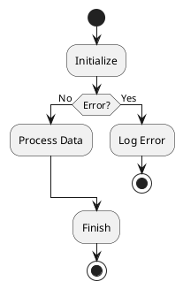

# Activity Diagram

Used to represent workflows or business processes.

## Syntax

### Start/Stop
* `start` - beginning of flow
* `stop` - end of flow
* `end` - alternative end keyword

### Actions
* `:Action Label;` - action/activity

### Conditionals
* `if (Condition?) then (Yes) \n :Action1; \n else (No) \n :Action2; \n endif`

### Loops
* `repeat` / `repeat while (Condition?)` - repeat until
* `while (Condition?) is (Yes) \n ... \n endwhile` - while loop

### Parallel
* `fork` / `fork again` / `end fork` - parallel paths

## Example



## Common Patterns

### While Loop
```puml
start
while (More items?) is (Yes)
    :Process Item;
endwhile (No)
stop
```

### Repeat Loop
```puml
start
:Process;
repeat
    :Try again;
repeat while (Failed?) is (Yes)
stop
```

### Parallel Fork
```puml
start
fork
    :Task A;
fork again
    :Task B;
fork again
    :Task C;
end fork
:Continue;
stop
```

### Switch/Case
```puml
switch (Type?)
case (A)
    :Handle A;
case (B)
    :Handle B;
endswitch
```

### Swimlanes
```puml
|User|
:Start;
|System|
:Process;
:Validate;
|User|
:View Result;
```
