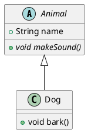

# Class Diagram

Used to describe the static structure of a system.

## Syntax

### Definitions
* `class ClassName` - basic class
* `interface InterfaceName` - interface
* `abstract AbstractClass` - abstract class
* `enum EnumName` - enumeration

### Members
* `Class { +type field \n +method() }` - fields and methods
* Use `{static}` for static members
* Use `{abstract}` for abstract methods

### Relationships
| Type | Arrow | Description |
|------|-------|-------------|
| Extension/Inheritance | `<|--` | "is a" relationship |
| Implementation | `<|..` | implements interface |
| Composition | `*--` | strong ownership |
| Aggregation | `o--` | weak ownership |
| Association | `-->` | basic relationship |
| Dependency | `..>` | uses relationship |

### Visibility
* `+` - public
* `-` - private
* `#` - protected
* `~` - package private

## Example



## Common Patterns

### Interface Implementation
```puml
interface Printable {
    +void print()
}
class Document implements Printable {
    +void print()
}
Printable <|.. Document
```

### Composition
```puml
class Car {
    +Engine engine
}
class Engine {
    +void start()
}
Car *-- Engine : contains
```

### Generic Types
```puml
class Container<T> {
    +T value
    +void add(T item)
}
```

### Multiple Relationships
```puml
class Student {
    +String name
}
class Course {
    +String title
}
Student "1..*" --> "*" Course : enrolls in
```
