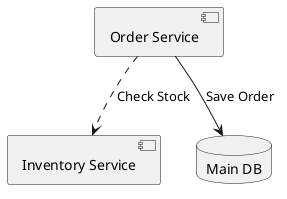

# Component Diagram

Used to visualize the organization and dependencies among components.

## Syntax

### Components
* `[Component Name]` - basic component
* `component "Name" as Alias` - named component with alias
* `["Component"]` - alternate syntax

### Interfaces
* `() "Interface Name"` - interface/circle notation
* `port` - port definition

### Nodes
* `node` - compute node
* `cloud` - cloud/external service
* `database` - database storage
* `storage` - general storage

### Relationships
* `-->` - solid dependency
* `..>` - dashed dependency
* `-down->` - directional arrow

## Example



## Common Patterns

### Component with Interface
```puml
interface "IDataAccess" as IDA
[UserService] as US
[Database] as DB
US ..> IDA
IDA <|.. DB
```

### Node Boundaries
```puml
node "Application Server" {
    [Service A]
    [Service B]
}
node "Database Server" {
    database "PostgreSQL"
}
[Service A] --> [PostgreSQL]
```

### Cloud Component
```puml
cloud "External API" {
    [Third Party Service]
}
[My App] --> [Third Party Service] : HTTPS
```

### Storage
```puml
[App] --> storage "File System"
[App] --> database "User DB"
```

### Multiple Components
```puml
[API Gateway] as GW
component "Auth Service" as Auth
component "User Service" as User
component "Data Service" as Data

GW --> Auth : Validate
GW --> User : Get User
GW --> Data : Fetch Data
```
