# Flowchart

A lightweight, non-UML alternative to activity diagrams for simple process flows.

## When to Use Flowchart vs Activity Diagram

| Use Flowchart When                | Use Activity Diagram When              |
| --------------------------------- | -------------------------------------- |
| Simple linear process             | Complex business workflow              |
| Quick visualization needed        | Formal UML documentation required      |
| Non-technical audience            | Need swimlanes/partitions              |
| Basic decision points only        | Advanced constructs (fork, join, etc.) |

## Syntax

### Basic Elements

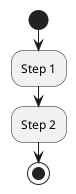

### Nodes

* `start` / `stop` - begin/end of flow
* `:Action Label;` - process step
* `if (Condition?) then (Yes)` - decision

### Arrows

* `->` - connection between nodes
* `-[#red,dashed]->` - styled connection
* `-->` - longer connection

### Labels

* `node Label` - labeled node
* `:Action;` - action with text

## Example

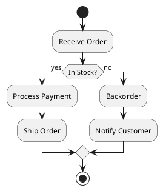

## Common Patterns

### Simple Decision

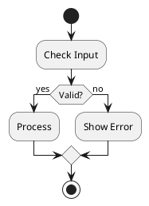

### Multiple Conditions

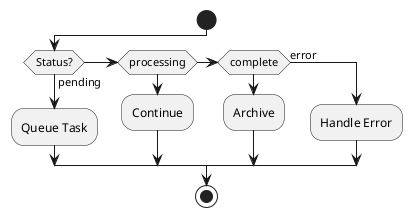

### While Loop

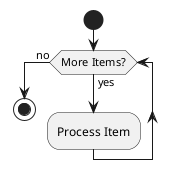

### Repeat Loop

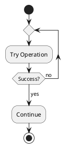

### Parallel Fork

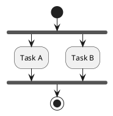

### Labeled Connections

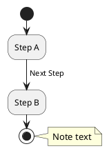

### Partition/Swimlane

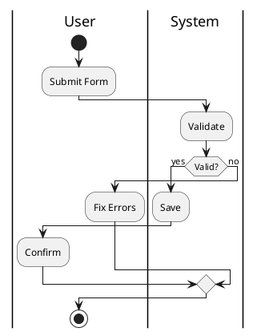

## Styling

### Colors

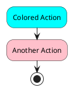

### Arrow Styles

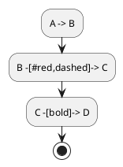

### Skinparam

```puml
skinparam activity {
  BackgroundColor #LightBlue
  BorderColor #Navy
  FontSize 14
}
```
