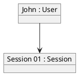

# Object Diagram

Used to show instances of classes and their relationships.

## Syntax

### Objects
* `object "Name : Class" as Alias` - object with instance name and class
* `object ClassName` - simple object notation

### Relations
Similar to Class diagrams but representing specific instances.

### Values
Add values after `:` to show attribute values
`object "obj : Class \n attr = value"`

## Example



## Common Patterns

### Object with Values
```puml
object "order1 : Order" as o1 {
    id = 12345
    total = 99.99
    status = "pending"
}
object "item1 : OrderItem" as i1 {
    product = "Widget"
    quantity = 2
}
o1 --> i1
```

### Multiple Instances
```puml
object "alice : User" as u1
object "bob : User" as u2
object "group1 : Group" as g1
u1 --> g1
u2 --> g1
```

### Link Labels
```puml
object "account : Account" as a
object "customer : Customer" as c
c --> a : owns
```

### Stereotypes
```puml
object "singleton : Manager <<singleton>>" as m
object "instance1 : Worker" as w1
object "instance2 : Worker" as w2
m --> w1
m --> w2
```

### Data Structure
```puml
object "head : Node" as n1 {
    value = 10
}
object "second : Node" as n2 {
    value = 20
}
object "tail : Node" as n3 {
    value = 30
}
n1 --> n2 : next
n2 --> n3 : next
```
