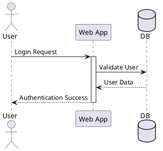

# Sequence Diagram

Used to visualize interactions between objects over time.

## Syntax

### Participants
* `actor` - external actor
* `participant` - generic participant
* `boundary` - system boundary
* `control` - controller
* `entity` - entity
* `database` - database/storage

### Messages
* `Sender -> Receiver : Message` - synchronous message
* `Sender ->> Receiver : Message` - asynchronous message
* `Receiver <-- Sender : Response` - return message
* `Sender -->> Receiver : Message` - dashed return

### Grouping
* `alt/else/opt` - alternative/optional paths
* `loop` - loop block
* `par` - parallel execution
* `group` - generic grouping

### Activation
* `activate` / `deactivate` - control focus
* `autoactivate on` - automatic activation

### Auto-numbering
* `autonumber` - number messages sequentially

## Example



## Common Patterns

### Alt/Else Block
```puml
alt Valid User
    App --> User : Success
else Invalid User
    App --> User : Error
end alt
```

### Loop Block
```puml
loop Retry 3 times
    App -> Service : Request
    Service --> App : Response
end loop
```

### Parallel Execution
```puml
par Send Email
    App -> EmailService : Send
and Log Activity
    App -> LogService : Log
end
```

### Auto-numbering
```puml
autonumber
A -> B : First message
B -> C : Second message
```
