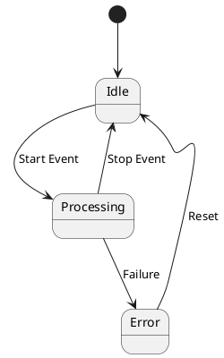

# State Diagram

Used to model the lifecycle of an object.

## Syntax

### States
* `[*]` - start/end state (initial/final)
* `state "State Name" as S` - named state with alias
* `state S1` - simple state definition

### Transitions
* `S1 --> S2 : Event` - transition with event label
* `S1 --> S2` - unlabeled transition

### Composition
* `state State1 { state SubStateA [*] --> SubStateB }` - composite state

### Entry/Exit Actions
* `state State { entry / Action1 exit / Action2 }`

## Example



## Common Patterns

### Entry/Exit Actions
```puml
state Active {
    entry / startTimer()
    exit / stopTimer()
}
```

### Composite State
```puml
state "Order Processing" as Processing {
    [*] --> Validating
    Validating --> Authorizing
    Authorizing --> Fulfilling
    Fulfilling --> [*]
}
```

### Concurrent States
```puml
state "Active" as Active {
    state "Connected" as Conn
    state "Authenticated" as Auth
    [*] --> Conn
    [*] --> Auth
}
```

### Choice State
```puml
state "Check Credit" {
    [*] --> Good
    [*] --> Bad
}
Good --> Approved
Bad --> Rejected
```

### Self-Transition
```puml
state Running
Running --> Running : Refresh
```

### Fork/Join
```puml
[*] --> Ready
Ready -down-> Processing1
Ready -down-> Processing2
Processing1 --> Done
Processing2 --> Done
Done --> [*]
```
