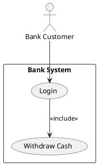

# Use Case Diagram

Used to represent system functionality and actors.

## Syntax

### Actors
* `actor` - basic actor definition
* `actor "Name" as Alias` - named actor with alias

### Use Cases
* `(Use Case Name)` - basic use case
* `(Use Case) as Alias` - use case with alias

### Relationships
* `-->` - basic association
* `..>` - dotted relationship (extend/include)

### Boundaries
* `rectangle "Boundary Name" { ... }` - system boundary

## Example



## Common Patterns

### Include Relationship
```puml
(Use Case A) as UC1
(Use Case B) as UC2
UC1 --> UC2 : <<include>>
```

### Extend Relationship
```puml
(Use Case A) as UC1
(Use Case B) as UC2
UC1 ..> UC2 : <<extend>>
```

### Multiple Actors
```puml
actor "Administrator" as Admin
actor "Regular User" as User
(Manage Users) as UC1
(View Profile) as UC2
Admin --> UC1
User --> UC2
```
