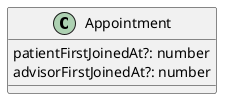
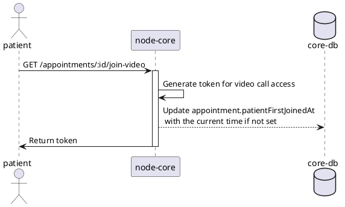
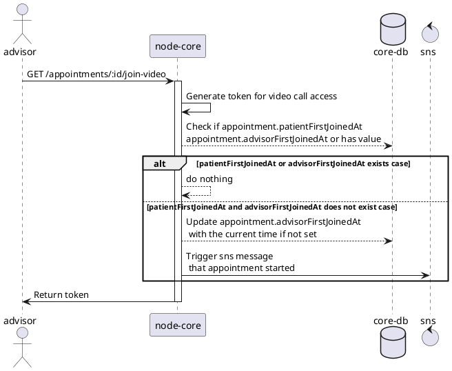
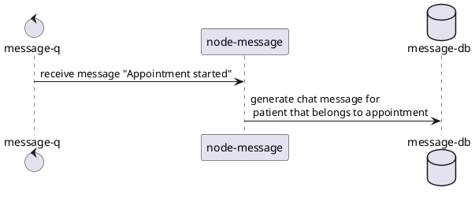

# [tech-spec] Add a notification when appointment starts

* 1 [Model](#Model)
  * 1.1 [node-core](#node-core)
    * 1.1.1 [Appointment](#Appointment)
* 2 [Flow](#Flow)
  * 2.1 [Backend](#Backend)
    * 2.1.1 [node-core](#node-core.1)
    * 2.1.2 [node-message](#node-message)
* 3 [Happy path](#Happy-path)

# Model

## node-core

### Appointment

advisorFirstJoinedAt → advisorFirstJoinedAt

# Flow

## Backend

### node-core

Patient is fetching a token for video access

Advisor is fetching a token for video access. (startNotifiedAt → advisorFirstJoinedAt)

### node-message

Generate a chat message for the patient to remind him that the appointment is starting.

# Happy path

If an Advisor joins the call before the patient, the patient should receive a chat message that the appointment is about to start or already started (depending on the moment when the advisor joins the call)

If the patient joins the call before the Advisor, no message about starting the appointment is sent.