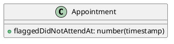

# [tech-spec] Appointment - Did not Attend

* 1 [Model](#Model)
  * 1.1 [node-core](#node-core)
* 2 [Flow](#Flow)
  * 2.1 [Backend](#Backend)
    * 2.1.1 [node-core](#node-core.1)
* 3 [Happy path](#Happy-path)

# Model

## node-core

add new field

# Flow

## Backend

### node-core

add new endpoints

* POST `/appointments/:appointmentId/did-not-attend-flag`
  * if the appointment is cancelled, then throw an error
  * if the appointment is already flagged with a did-not-attend flag, then throw an error
  * if the appointment starts in future, then throw an error
  * set the current timestamp to appointment.flaggedDidNotAttendAt
* DELETE `/appointments/:appointmentId/did-not-attend-flag`
  * if the appointment is cancelled, then throw an error
  * if the appointment is not flagged with a did-not-attend flat, then throw an error
  * remove the value from the appointment.flaggedDidNotAttendAt
* update behaviour PUT `/appointments/:appointmentId/cancel`
  * if the appointment is flagged with a did-not-attend flat, then throw an error
  * if the appointment startAt is in the past, then throw an error

# Happy path

* Check if an appointment can be flagged for did-not-attend successfully.
* Verify that an error is thrown when trying to flag a cancelled appointment for did-not-attend.
* Ensure an error is thrown when attempting to flag an appointment already flagged for did-not-attend.
* Test if the current timestamp is correctly set to the appointment's flaggedDidNotAttendAt field upon flagging.
* Confirm that removing the did-not-attend flag from an appointment works as expected.
* Validate that an error is thrown when removing the flag from a cancelled appointment.
* Check if an error is thrown when attempting to remove the flag from an appointment not flagged for did-not-attend.
* Check if cancelling an appointment flagged with did-not-attend will throw an error.