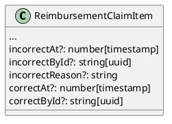
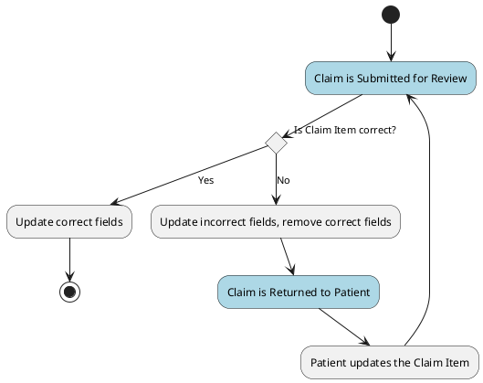
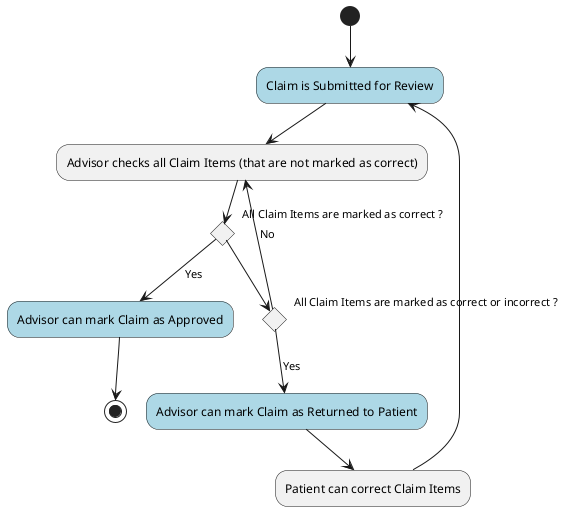

# [tech-spec] - Claim item locking

* 1 [Model](#Model)
  * 1.1 [node-core](#node-core)
* 2 [Flow](#Flow)
  * 2.1 [Backend](#Backend)
    * 2.1.1 [node-core: Claim item correct/incorrect flow](#node-core%3A-Claim-item-correct%2Fincorrect-flow)
    * 2.1.2 [node-core: Claim correct/incorrect flow](#node-core%3A-Claim-correct%2Fincorrect-flow)
* 3 [Happy path](#Happy-path)

# Model

## node-core

ReimbursementClaimItem

# Flow

## Backend

### node-core: Claim item correct/incorrect flow

### node-core: Claim correct/incorrect flow

# Happy path

TODO: Add details here