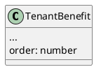

# [tech-spec] Custom order for tenant benefits

* 1 [Infrastructure](#Infrastructure)
  * 1.1 [node-core](#node-core)
* 2 [Model](#Model)
  * 2.1 [node-core](#node-core.1)

# Infrastructure

## node-core

* PATCH /tenant-benefits/:tenantBenefitId/order
  * body: { direction: up/down }

# Model

## node-core

