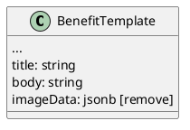

# [tech-spec] Enable Advisors to Manage Benefits

* 1 [Infrastructure](#Infrastructure)
  * 1.1 [node-core](#node-core)
* 2 [Model](#Model)
  * 2.1 [node-core](#node-core.1)
    * 2.1.1 [BenefitTemplate](#BenefitTemplate)
* 3 [Flow](#Flow)
  * 3.1 [Frontend](#Frontend)
    * 3.1.1 [Web](#Web)
      * 3.1.1.1 [Benefits Template List screen](#Benefits-Template-List-screen)
      * 3.1.1.2 [Benefits Template Detail screen (create/edit)](#Benefits-Template-Detail-screen-\(create%2Fedit\))
      * 3.1.1.3 [Tenant Benefits List](#Tenant-Benefits-List)
      * 3.1.1.4 [Tenant Benefit Create/Edit](#Tenant-Benefit-Create%2FEdit)
* 4 [Happy path](#Happy-path)
* 5 [Backwards compatibility](#Backwards-compatibility)

# Infrastructure

## node-core

Add permissions for BenefitTemplate and TenantBenefit entities

Create CRUD for Benefit Template

* GET /benefit-templates
  * pagination,
  * filter
    * byName: we can use `ILIKE %<name>%`
    * byContent: we can use fuzzy search, and for the content we can use `title` and `body` fields
* GET /benefit-templates/:id
* POST /benefit-templates
* PATCH /benefit-templates/:id
* DELETE /benefit-templates/:id

Create CRUD for Tenant Benefit

* GET /tenant-benefits
  * pagination,
  * filter
    * tenantId
    * benefitTemplateId
* GET /tenant-benefits/:id
* POST /tenant-benefits
* PATCH /tenant-benefits/:id
* DELETE /tenant-benefits/:id

when getting tenant-benefits always fetch data for benefit-template using relations

# Model

## node-core

### BenefitTemplate

When adding a title in migration, copy the value from the column name to the title.

When adding a body in migration, move data from description to body.

When removing the imageData field, check if it is still used.

If possible, write a migration to have the name field unique.

# Flow

## Frontend

### Web

#### Benefits Template List screen

(this is the screen where we can see all available templates and create new)

Filters: Name(text), Content(text) {content is fuzzy search for data in title and body}

Add pagination

#### Benefits Template Detail screen (create/edit)

Here, we have a screen that we will use to create or edit templates.

Also, we have two additional components next to the simple input form:

* Params—This component converts a JSON object into a table for simple input and reading. (This component will be used in multiple places in the benefits template scope.
* BenefitTemplateBodyMarkdownPreview—This component renders markdown from the benefit.body and implements parameters, switching the template keys with values (using handlebars). This functionality is already implemented on the backend, and we need to implement it on the front or move it to the common lib.

#### Tenant Benefits List

Here, we have a list of all benefits connected to employers. We also see the parameters if they are used, and we can see the preview as an accordion item.

We need to have a filter by Employer ID and by Benefit name.

Filters: Employer(dropdown), BenefitName(dropdown)

Add pagination

#### Tenant Benefit Create/Edit

This screen will create or edit the connection between the benefit and the tenant.

Here, we use the params component and have two dropdowns from employer and benefits. At the bottom, we have a preview of the template body. We are rendering markdown and applying parameters.

# Happy path

Advisor can create, edit, and delete benefit templates. Advisor can connect benefits to tenants with custom parameters. Preview shows rendered markdown with parameters applied.

# Backwards compatibility

We are changing the benefits template table signature, so we must ensure the old endpoint works. The old fields Name and Descriptions must be mapped to the new fields Title and Body.