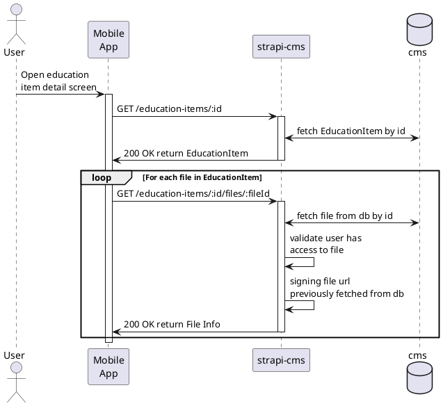
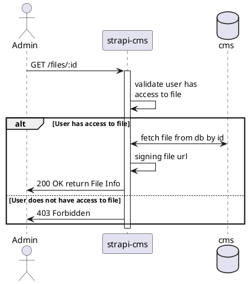
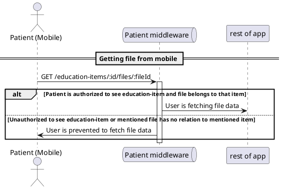

# [tech-spec] Implementing new approach for caching media

* 1 [Infrastructure](#Infrastructure)
  * 1.1 [Endpoint available only from admin panel](#Endpoint-available-only-from-admin-panel)
  * 1.2 [Endpoints available from patient side](#Endpoints-available-from-patient-side)
  * 1.3 [Response body](#Response-body)
* 2 [Flow](#Flow)
  * 2.1 [Gaining file info](#Gaining-file-info)
  * 2.2 [Authorization check](#Authorization-check)
    * 2.2.1 [Admin side](#Admin-side)
    * 2.2.2 [Patient side](#Patient-side)
* 3 [Happy path](#Happy-path)
  * 3.1 [Admin panel Rich text editor](#Admin-panel-Rich-text-editor)
  * 3.2 [Mobile usage of media filesIn mobile no change should be visible, so we need to use postman to validate new patient endpoints](#Mobile-usage-of-media-files%5BhardBreak%5D%5BhardBreak%5DIn-mobile-no-change-should-be-visible%2C-so-we-need-to-use-postman-to-validate-new-patient-endpoints)

# Infrastructure

## Endpoint available only from admin panel

(using Authorization from header as standard strapi auth)

* GET `<strapi-cms>/api/files/:fileId`

## Endpoints available from patient side

(using jwtoken from header as a custom auth used for mobile access)

* GET `<strapi-cms>/api/education-items/:id/files/:fileId`
* GET `<strapi-cms>/api/advisors/:id/files/:fileId`

Both endpoints have optional query parameters:

* format `thumbnail | small | medium | large`
* type `icon | image | video | video_thumbnail | embedded`

## Response body

(every endpoint will return the same data, url will already be signed by cloudfront)

```
{ url: string; fileName: string; mime: string; size: number; }
```

# Flow

(using education item entity as an example)

## Gaining file info




## Authorization check

#### Admin side

To access endpoint, admin needs to be authenticated.



#### Patient side

To access endpoint, patient requirements are:

1. To be authenticated (have valid **jwtoken** in request header)
2. To have access to education item (have access to service type to which ed. i. belongs to) for which **educationItemId** is provided
3. EducationItem to have file with provided **fileId**



# Happy path

### Admin panel Rich text editor

1. Log in to the strapi-cms admin panel as an admin user.
2. Create a new Education Item
3. Add an image to the content of the Education Item
4. Check if the image link is formatted as `[image name](file id)` instead of  
   `[image name](https://file_url)`
5. Toggle the contents preview and the image that we added should be displayed.

### Mobile usage of media files

In mobile no change should be visible, so we need to use postman to validate new patient endpoints

1. Authenticate as patient
2. Create or update education item and advisor entity in admin panel so they would have image/icon/video or embedded image link inside content filed
3. Run **education-itmes/:id** endpoint (also **advisors/:id**) (ckeck if that new content is visible in response)
4. Now, run **\[educartion-items od advisors\]/:id/files/:fileId** using image/icon/video id or embeddedLink id (`[imag name](id)`) as fileId in above mentioned endpoint
5. Response should return { data: { fileName, size, url }}
6. Try changing file id to value that is not part of that entity, run again, is should return Forbidden error
7. Try switching to education item that is not allowed, forbidden error should be thrown in this case also. (advisors are allowed for everyone, so this check does not include them)