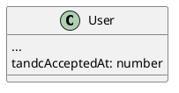

# [tech-spec] Terms and Conditions Acceptance Tracking

* 1 [Infrastructure](#Infrastructure)
  * 1.1 [node-auth](#node-auth)
* 2 [Model](#Model)
  * 2.1 [node-auth](#node-auth.1)
    * 2.1.1 [Config](#Config)
    * 2.1.2 [User](#User)
    * 2.1.3 [JWT](#JWT)
* 3 [Happy path](#Happy-path)

# Infrastructure

## node-auth

* POST /users/me/terms-and-conditions/latest/accept
  * response `{"successful": true}`

# Model

## node-auth

### Config

Add new value to auth.config table

* key: `terms-and-conditions`
* value: `{ "latestAvailableAt": <UTC timestamp>}`

### User

### JWT

add `tandcAcceptedAt: number` to JWT

calculate and add `hasAcceptedLatestTandc: boolean` to JWT

# Happy path

Check that the user cannot use the app if he doesn’t accept the latest T&C.  
After accepting the latest T&C, the user should be able to use the app with no restrictions.