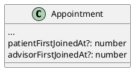
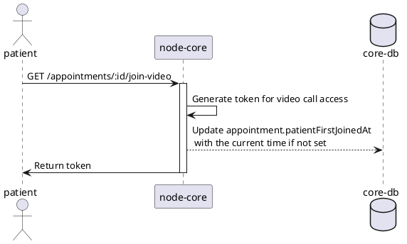
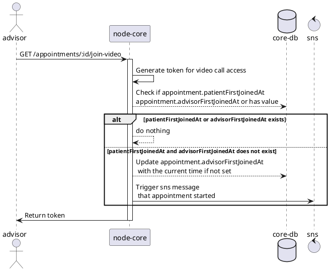
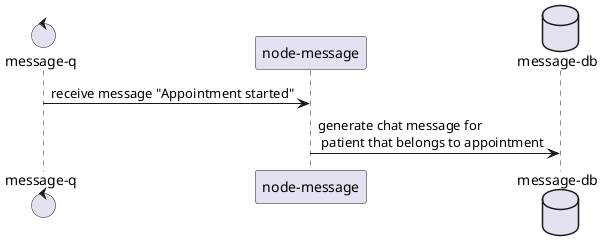
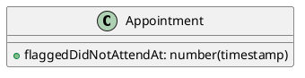
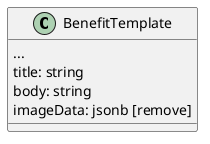
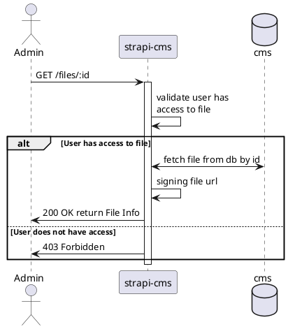
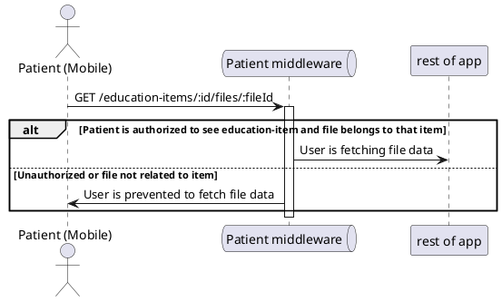

# Tech Spec Examples

This file contains detailed examples for various tech spec scenarios. Read this when you need reference patterns for complex specs.

## Table of Contents

1. [Cross-Service Communication](#cross-service-communication)
2. [Complex State Flows](#complex-state-flows)
3. [Frontend + Backend Integration](#frontend--backend-integration)
4. [Media/File Handling](#mediafile-handling)

---

## Cross-Service Communication

When multiple services need to coordinate, use sequence diagrams to show the interaction.

### Example: Notification when appointment starts

```markdown
# [tech-spec] Add a notification when appointment starts

* 1 [Model](#Model)
  * 1.1 [node-core](#node-core)
    * 1.1.1 [Appointment](#Appointment)
* 2 [Flow](#Flow)
  * 2.1 [Backend](#Backend)
    * 2.1.1 [node-core](#node-core.1)
    * 2.1.2 [node-message](#node-message)
* 3 [Happy path](#Happy-path)

# Model

## node-core

### Appointment



# Flow

## Backend

### node-core

Patient is fetching a token for video access:



Advisor is fetching a token for video access:



### node-message

Generate a chat message for the patient:



# Happy path

If an Advisor joins the call before the patient, the patient should receive a chat message that the appointment is about to start.

If the patient joins the call before the Advisor, no message about starting the appointment is sent.
```

---

## Complex State Flows

Use activity diagrams to show conditional logic and state transitions.

### Example: Appointment did-not-attend flagging

```markdown
# [tech-spec] Appointment - Did not Attend

* 1 [Model](#Model)
  * 1.1 [node-core](#node-core)
* 2 [Flow](#Flow)
  * 2.1 [Backend](#Backend)
    * 2.1.1 [node-core](#node-core.1)
* 3 [Happy path](#Happy-path)

# Model

## node-core

Add new field:



# Flow

## Backend

### node-core

Add new endpoints:

* POST `/appointments/:appointmentId/did-not-attend-flag`
  * if the appointment is cancelled, then throw an error
  * if the appointment is already flagged with a did-not-attend flag, then throw an error
  * if the appointment starts in future, then throw an error
  * set the current timestamp to appointment.flaggedDidNotAttendAt
* DELETE `/appointments/:appointmentId/did-not-attend-flag`
  * if the appointment is cancelled, then throw an error
  * if the appointment is not flagged with a did-not-attend flat, then throw an error
  * remove the value from the appointment.flaggedDidNotAttendAt
* update behaviour PUT `/appointments/:appointmentId/cancel`
  * if the appointment is flagged with a did-not-attend flat, then throw an error
  * if the appointment startAt is in the past, then throw an error

# Happy path

* Check if an appointment can be flagged for did-not-attend successfully.
* Verify that an error is thrown when trying to flag a cancelled appointment.
* Ensure an error is thrown when attempting to flag an appointment already flagged.
* Test if the current timestamp is correctly set to the flaggedDidNotAttendAt field.
* Confirm that removing the did-not-attend flag works as expected.
* Check if cancelling an appointment flagged with did-not-attend will throw an error.
```

---

## Frontend + Backend Integration

When a feature spans both frontend and backend, document both sides.

### Example: Enable Advisors to Manage Benefits

```markdown
# [tech-spec] Enable Advisors to Manage Benefits

* 1 [Infrastructure](#Infrastructure)
  * 1.1 [node-core](#node-core)
* 2 [Model](#Model)
  * 2.1 [node-core](#node-core.1)
    * 2.1.1 [BenefitTemplate](#BenefitTemplate)
* 3 [Flow](#Flow)
  * 3.1 [Frontend](#Frontend)
    * 3.1.1 [Web](#Web)
* 4 [Happy path](#Happy-path)
* 5 [Backwards compatibility](#Backwards-compatibility)

# Infrastructure

## node-core

Add permissions for BenefitTemplate and TenantBenefit entities

Create CRUD for Benefit Template:

* GET /benefit-templates
  * pagination
  * filter byName (ILIKE %<name>%)
  * filter byContent (fuzzy search on title and body)
* GET /benefit-templates/:id
* POST /benefit-templates
* PATCH /benefit-templates/:id
* DELETE /benefit-templates/:id

Create CRUD for Tenant Benefit:

* GET /tenant-benefits
  * pagination
  * filter by tenantId, benefitTemplateId
* GET /tenant-benefits/:id
* POST /tenant-benefits
* PATCH /tenant-benefits/:id
* DELETE /tenant-benefits/:id

# Model

## node-core

### BenefitTemplate



Migration notes:
- When adding title, copy value from name column
- When adding body, move data from description to body
- When removing imageData, check if still used

# Flow

## Frontend

### Web

#### Benefits Template List screen

Filters: Name(text), Content(text)

Add pagination

#### Benefits Template Detail screen (create/edit)

Components:
* Params - converts JSON object to table for input
* BenefitTemplateBodyMarkdownPreview - renders markdown with handlebars parameter substitution

#### Tenant Benefits List

List of all benefits connected to employers. Show parameters and preview as accordion.

Filters: Employer(dropdown), BenefitName(dropdown)

Add pagination

#### Tenant Benefit Create/Edit

Use params component with dropdowns for employer and benefits. Preview template body at bottom.

# Happy path

Advisor can create, edit, and delete benefit templates. Advisor can connect benefits to tenants with custom parameters.

# Backwards compatibility

Old fields Name and Description must be mapped to new fields Title and Body. The old endpoint must continue to work during migration.
```

---

## Media/File Handling

For features involving file access, show authorization flows.

### Example: Caching media with signed URLs

```markdown
# [tech-spec] Implementing new approach for caching media

* 1 [Infrastructure](#Infrastructure)
  * 1.1 [Admin endpoints](#Admin-endpoints)
  * 1.2 [Patient endpoints](#Patient-endpoints)
  * 1.3 [Response body](#Response-body)
* 2 [Flow](#Flow)
  * 2.1 [Authorization check](#Authorization-check)
* 3 [Happy path](#Happy-path)

# Infrastructure

## Admin endpoints

(using Authorization header as standard strapi auth)

* GET `<strapi-cms>/api/files/:fileId`

## Patient endpoints

(using jwtoken from header for mobile access)

* GET `<strapi-cms>/api/education-items/:id/files/:fileId`
* GET `<strapi-cms>/api/advisors/:id/files/:fileId`

Optional query parameters:
* format: `thumbnail | small | medium | large`
* type: `icon | image | video | video_thumbnail | embedded`

## Response body

```json
{
  "url": "string",
  "fileName": "string",
  "mime": "string",
  "size": number
}
```

# Flow

## Authorization check

### Admin side



### Patient side

Requirements:
1. Valid jwtoken in request header
2. Access to education item (service type)
3. EducationItem has file with provided fileId



# Happy path

### Admin panel Rich text editor

1. Log in to strapi-cms admin panel
2. Create a new Education Item
3. Add an image to the content
4. Check if image link is formatted as `[image name](file id)`
5. Toggle preview - image should be displayed

### Mobile usage of media files

1. Authenticate as patient
2. Create education item with image in admin panel
3. Call education-items/:id endpoint - verify content visible
4. Call /education-items/:id/files/:fileId with file id
5. Response should return { fileName, size, url }
6. Try invalid file id - should return Forbidden
7. Try education item not allowed - should return Forbidden
```
